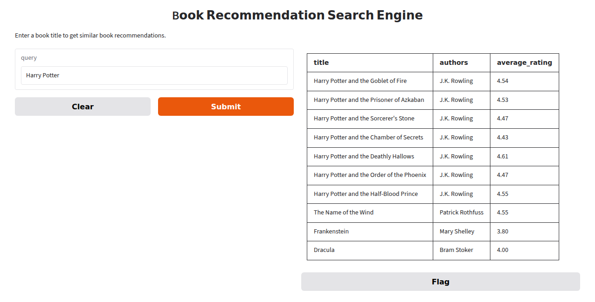

# Book Recommendation Engine

Type in a book title and get back 10 similar books. Content-based, no user accounts, no click history. Two backends do the actual matching, and this README is mostly about the difference between them.



*Screenshot is a search against a small hand-built sample of 50 well-known books, used here for demonstration. The real dataset (see below) has around 11,100. The screenshot predates the backend flag, so the description line under the title box in a current run will say "Backend: tfidf" or "Backend: embeddings" - the image doesn't show that.*

## What it does

Every book's title, authors, publisher, and language code get cleaned (strip punctuation, lowercase, drop stopwords) and concatenated into one `combined_text` field. Search is two steps, and this is true for both backends: first, turn the query into the same kind of vector the books are stored as, and use it to find the single closest book. Second, take that book's precomputed similarity row against every other book, and return the top 10. So a search is really "find the book closest to what I typed, then show me what's like that book," not a direct match against your query.

The only thing that changes between backends is what "vector" and "similarity" mean.

## TF-IDF vs. embeddings

**TF-IDF** (`book_recommender/recommender.py`, the original approach) represents each book as a sparse bag-of-words vector: which words appear, weighted by how rare they are across the corpus. Matching is literal - a query only pulls in a book if they share actual words. Nothing to download, nothing to cache, fits in a couple of seconds every time you start the app.

**Embeddings** (`book_recommender/embeddings.py`, new) represents each book as a dense 384-dimensional vector from `all-MiniLM-L6-v2`, a small sentence-transformer model. Matching is semantic - "a scheme to secretly monitor everyone" can land near a book with none of those words in its title, if the model judges them related in meaning. First run downloads the model from Hugging Face and encodes every book; after that, encoded vectors are cached to disk (`.cache/embeddings/`, gitignored) and reloaded instead of recomputed.

One real structural difference, not just "swap the vectorizer": the TF-IDF backend fits *two* separate vector spaces - a title-only one to anchor the query, and a wider title+author+publisher+language one to rank neighbors - because a raw bag-of-words query can't be meaningfully compared against a book-to-book matrix built from a different vocabulary. The embeddings backend doesn't need that split. One encoding of `combined_text` serves both steps: the query gets embedded in the same space and compared directly. That's arguably a fairer test of "what can this representation do," since it isn't leaning on a second, narrower vector space to compensate for weak matching in the first.

Pick the backend with `--backend`:

```
python run.py --backend tfidf        # default
python run.py --backend embeddings
```

Defaults to `tfidf` because it needs no model download and starts in a few seconds. `embeddings` needs `sentence-transformers` and `torch` installed (both are in requirements.txt now) and downloads roughly 90MB of model weights the first time it runs.

## Query comparison, real output

These are actual outputs from both backends against the full ~11,100-book dataset, run right before writing this. Nothing here is invented.

### Where embeddings wins: no shared vocabulary with the target

**Query: `"a detective solves crimes using pure logic and observation"`**

Nothing in that sentence is a Sherlock Holmes title word, so the TF-IDF anchor step has nothing to grab onto and lands somewhere irrelevant:

TF-IDF anchors on *Logic and Philosophy: A Modern Introduction* (title-similarity score 0.285, the highest of a weak field) and then ranks off that book's combined-text neighbors - other philosophy titles, nothing about detectives:

| title | authors |
|---|---|
| Logic and Philosophy: A Modern Introduction | Alan Hausman/Paul Tidman |
| The Riverside Milton | John Milton/Roy C. Flannagan |
| Illustrated Guide to the NEC | Charles R. Miller |
| An Introduction to Political Philosophy | Jonathan Wolff |
| Introduction to the Philosophy of History... | Georg Wilhelm Friedrich Hegel/Leo Rauch |
| Presocratic Philosophy: A Very Short Introduction | Catherine Osborne |
| Jean-Paul Sartre (The Giants of Philosophy) | John Compton/Charlton Heston |

Embeddings anchors on *The Science of Sherlock Holmes* (similarity score 0.574, almost double TF-IDF's best) and every one of the 10 results is Holmes or true-crime related:

| title | authors |
|---|---|
| The Science of Sherlock Holmes | E.J. Wagner |
| The Mysteries of Sherlock Holmes | Arthur Conan Doyle/Paul Bachem |
| Sherlock Holmes and the Case of the Hound of the Baskervilles | Malvina G. Vogel/Arthur Conan Doyle |
| Las aventuras de Sherlock Holmes | Arthur Conan Doyle/Javier Gomez Rea |
| The Ghosts in Baker Street | Martin H. Greenberg/Daniel Stashower |
| The Extraordinary Cases of Sherlock Holmes | Arthur Conan Doyle |
| Criminal Investigation: The Art and the Science | Michael D. Lyman |
| The New Annotated Sherlock Holmes | Arthur Conan Doyle/Leslie S. Klinger |
| Crime Stories and Other Writings | Dashiell Hammett/Steven Marcus |
| In the Name of Love and Other True Cases | Ann Rule |

Zero relevant results from TF-IDF, ten out of ten from embeddings. This is the structural gap the task description points at: no amount of keyword tuning fixes a query that shares no words with the thing it's describing.

**Query: `"young wizard goes to a magic school"`**

Same shape of problem, smaller gap. TF-IDF anchors on *The Wizard (The Wizard Knight #2)* by Gene Wolfe (score 0.455, on the strength of the word "wizard") and then chains into other Wolfe and Terry Goodkind fantasy - genre-correct, but zero Harry Potter books anywhere in the 10 results, despite Harry Potter being the obvious answer to this query and the single best-represented series in the dataset (dozens of editions).

Embeddings anchors on *Castle of Wizardry (The Belgariad #4)* by David Eddings (score 0.510) and also drifts into other epic fantasy - but *Harry Potter and the Half-Blood Prince* shows up at rank 7 of 10. Not a clean win like the detective query, but it's the difference between "the target book never appears" and "the target book gets found despite an indirect query."

### Where TF-IDF wins: exact title lookup

**Query: `"Dracula"`**

TF-IDF anchors with a perfect score of 1.0 (the query, cleaned, is a literal exact match for the book's cleaned title) and returns four separate editions of Stoker's *Dracula*, plus two more Stoker titles, plus genuine Dracula scholarship:

| title | authors |
|---|---|
| Dracula | Bram Stoker/Jan Needle/Gary Blythe |
| Dracula | Bram Stoker |
| Dracula | Bram Stoker/Joseph Valente |
| Dracula | Bram Stoker/Nina Auerbach/David J. Skal |
| The Bram Stoker Bedside Companion | Bram Stoker/Charles Osborne |
| Dracula | Bram Stoker/Robert Whitfield |
| Lair of the White Worm | Bram Stoker |
| Best Ghost and Horror Stories | Bram Stoker/Richard Dalby |
| In Search of Dracula: The History of Dracula and Vampires | Raymond T. McNally/Radu Florescu |

Embeddings does not anchor on the novel at all. It anchors on *In Search of Dracula: The History of Dracula and Vampires* (score 0.694) - a nonfiction book that just says "Dracula" more often and with more surrounding context than the terse one-word title of the actual novel does, so it sits closer to the query in embedding space. The actual Stoker novel only shows up at rank 2:

| title | authors |
|---|---|
| In Search of Dracula: The History of Dracula and Vampires | Raymond T. McNally/Radu Florescu |
| Dracula | Bram Stoker |
| Happy Hour at Casa Dracula (Casa Dracula #1) | Marta Acosta |
| A Dracula Handbook | Elizabeth Russell Miller |
| Midnight Brunch (Casa Dracula #2) | Marta Acosta |
| Dracula Was a Woman | Raymond T. McNally |
| The Vampire Armand (The Vampire Chronicles #6) | Anne Rice |
| The Vampire Lestat (The Vampire Chronicles #2) | Anne Rice |

Two of those top 10 are a contemporary vampire-romance series by Marta Acosta that has nothing to do with Stoker beyond sharing the word "Dracula." For a query that's just the name of the book you want, exact lexical match is the right tool, and TF-IDF's 1.0 similarity is a stronger, more literal signal than anything a semantic model produces for one bare word.

## Performance at ~11,100 books

Measured on the real dataset (`data/books.csv`, 11,123 books after a few malformed rows get skipped), fresh venv, Windows, CPU only. Each number is a full process start: import libraries, load and clean the CSV, fit or load vectors, build the similarity matrix, ready to answer a query.

| | TF-IDF | Embeddings |
|---|---|---|
| Cold start, nothing cached at all | 3.2s (downloads NLTK stopwords) | 35.1s (downloads the ~90MB model, then encodes all 11,123 books) |
| Cold start, model/NLTK data already cached, no embedding cache | 2.7s (no caching exists for TF-IDF - this is just a normal run) | 29.1s (encodes all 11,123 books) |
| Warm start, everything cached | 2.7s (same - TF-IDF has nothing to warm) | ~12.0s |
| Peak RSS | ~1.18 GB | ~1.0-1.16 GB |

TF-IDF has no persistent cache of its own, so there's no real cold/warm distinction for it beyond the one-time NLTK download - every run refits both vectorizers from scratch in under 3 seconds.

The embeddings warm-start number is the one worth unpacking, because the disk cache barely moves it. Loading the cached `.npy` file takes 7 milliseconds. Loading the SentenceTransformer model into memory - importing torch, initializing the model object, no encoding yet - takes about 7 seconds, every single process start, cache or no cache. So the disk cache saves you the ~20 seconds of encoding 11,123 books, not the ~7 seconds of loading the model, and warm start is still 4-5x slower than TF-IDF.

Peak memory is close between the two backends, and for a reason that has nothing to do with TF-IDF vs. embeddings: both backends build a dense 11,123 x 11,123 `float32` similarity matrix (`cosine_sim_combined`), and that matrix alone is about 495MB regardless of which representation produced it. That single matrix, not the vectors themselves, is the dominant cost in both backends' memory footprint. See "known issues" below.

Installed size is not close, though. `sentence-transformers` pulls in `torch`, and torch alone is about 490MB on disk. The TF-IDF-only dependency set (pandas, numpy, nltk, scikit-learn, gradio) is about 216MB. Installing `requirements.txt` as it stands now costs roughly 1.15GB of disk regardless of which backend you actually plan to use, since both backends' dependencies are installed together. Worth knowing before you `pip install` on a constrained machine.

## Known issues

Found while building this, left as-is per the scope of this change - flagging instead of fixing.

- **No similarity floor, either backend.** A query with no real connection to anything in the corpus still returns 10 confident-looking results, because `get_recommendations` always takes the argmax and the top 10, with no minimum-similarity cutoff. Tested with the nonsense query `"xzqvbn qwrty asdfgh"`: TF-IDF's title similarities are all exactly zero, so `argmax` deterministically returns index 0, and the query returns Harry Potter and the Half-Blood Prince recommendations every time (that's just the first row in the CSV). Embeddings don't have this exact failure mode - dense vectors are essentially never exactly zero similarity - so the same nonsense query anchors on a real book (a Roger Zelazny novel, in testing) and returns a plausible-looking table with nothing to indicate the match is meaningless. Neither UI surfaces the similarity score, so a user can't tell a confident match from a coin flip.
- **Embedding cache identity is loose.** The cache key is built from the CSV path's size and mtime plus the model name, not the file's content and not the DataFrame actually passed in. `EmbeddingRecommender(df, csv_path)` trusts that `df` was in fact loaded from `csv_path` - if a caller passes a mismatched pair, the cache will silently serve vectors for the wrong data. The path also gets resolved relative to the current working directory, so running `python run.py` from somewhere other than the repo root produces a different cache key for what is, on disk, the same file.
- **The similarity matrix is O(n^2) memory, for both backends.** At 11,123 books it's already ~495MB by itself. Growing the catalog by 40% would grow that matrix by roughly double. This is the actual scaling ceiling here, and it doesn't come from choosing TF-IDF over embeddings or vice versa - both backends build the same full book-to-book matrix. A nearest-neighbor index would sidestep this; neither backend has one.
- **Pre-existing, not touched by this change:** `recommend_books` in `app.py` checks `if recommendations.empty` and shows a "no similar books found" message, but `get_recommendations` always returns exactly 10 rows (or however many exist, if fewer) with no relevance threshold. That branch can't fire for either backend.

## Dataset

Not included in this repo. It's the [Goodreads-books dataset](https://www.kaggle.com/datasets/jealousleopard/goodreadsbooks) on Kaggle - a scrape of Goodreads metadata rather than an official export, and Kaggle doesn't list a clear license for redistribution, so I'm pointing to the source instead of shipping a copy. Download `books.csv` yourself and drop it in `data/` (see `data/README.md` for the exact columns this app reads). Any CSV with `title`, `authors`, `publisher`, `language_code`, and `average_rating` columns will work.

## Running it

```
python -m venv venv
source venv/bin/activate
pip install -r requirements.txt
# put books.csv in data/ - see data/README.md
python run.py                      # TF-IDF backend, default
python run.py --backend embeddings # semantic backend, downloads a model on first run
```

Opens at `http://127.0.0.1:7860`. TF-IDF's first run downloads the NLTK stopwords corpus; the embeddings backend's first run additionally downloads the `all-MiniLM-L6-v2` model from Hugging Face and encodes the whole dataset, then caches those vectors to `.cache/embeddings/` for next time. Both downloads are cached locally after the first run and don't touch the network again. Tested on Python 3.13, Windows, CPU only - no GPU-specific code path exists for the embeddings backend.

## Structure

```
book_recommender/
  data_loader.py   loading + text cleaning (shared by both backends)
  recommender.py   TF-IDF vectorizers + cosine similarity scoring
  embeddings.py    sentence-transformer embeddings + cosine similarity scoring
  app.py           Gradio interface, picks a backend at build time
run.py             entry point - python run.py [--backend tfidf|embeddings]
data/              put books.csv here, not tracked in git
.cache/embeddings/ cached embedding vectors, not tracked in git, rebuilt on first embeddings run
docs/              screenshot
```
